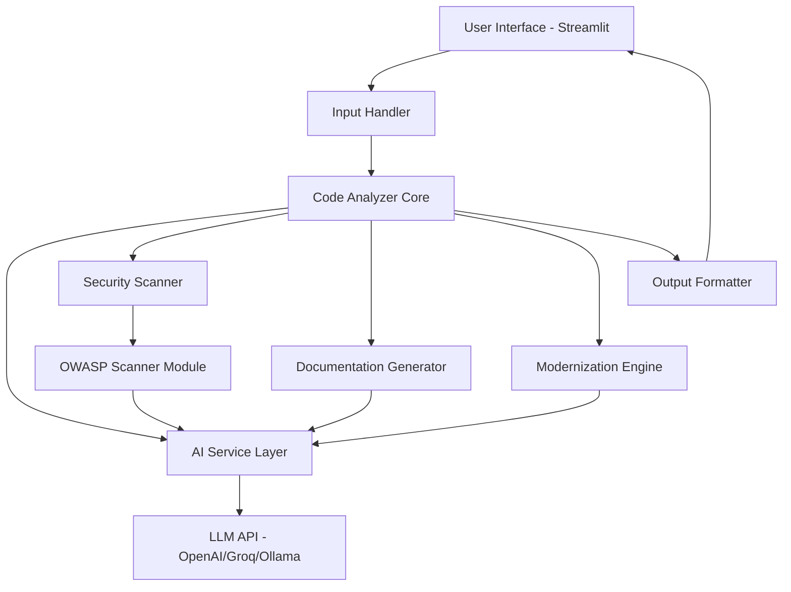

# RepoPilot - Implementation Plan

## Executive Summary

RepoPilot is an AI-powered development co-pilot designed for hackathon demonstration. It analyzes code and provides intelligent insights including explanations, security scanning, documentation generation, and modernization suggestions. This plan outlines a 2-3 day MVP implementation strategy using Python and Streamlit.

---

## 1. Project Architecture Overview

### High-Level System Design



### Component Interaction Flow

1. **Input Layer**: User pastes code or uploads file via Streamlit UI
2. **Processing Layer**: Code is parsed, analyzed, and routed to appropriate modules
3. **AI Service Layer**: Centralized LLM interaction for all AI-powered features
4. **Analysis Modules**: Specialized processors for security, documentation, and modernization
5. **Output Layer**: Formatted results displayed in organized Streamlit tabs/sections

### Technology Stack Justification

| Technology | Purpose | Justification |
|------------|---------|---------------|
| **Python 3.10+** | Core Language | Excellent AI/ML ecosystem, rapid development |
| **Streamlit** | UI Framework | Fast prototyping, built-in components, no frontend code needed |
| **OpenAI API** | Primary LLM | High quality, well-documented (fallback: Groq/Ollama) |
| **Bandit** | Security Scanning | Python-native OWASP scanner, easy integration |
| **Pygments** | Syntax Highlighting | Multi-language support for code display |
| **python-dotenv** | Config Management | Secure API key handling |
| **Pandas** | Data Processing | Analysis result formatting and export |

---

## 2. Folder Structure

```
RepoPilot/
├── .env.example                 # Environment variables template
├── .gitignore                   # Git ignore patterns
├── requirements.txt             # Python dependencies
├── README.md                    # Project documentation
├── config.py                    # Configuration settings
├── app.py                       # Main Streamlit application
│
├── docs/                        # Documentation
│   ├── IMPLEMENTATION_PLAN.md   # This file
│   ├── API_GUIDE.md            # API integration guide
│   └── USER_GUIDE.md           # End-user documentation
│
├── src/                         # Source code
│   ├── __init__.py
│   │
│   ├── core/                    # Core business logic
│   │   ├── __init__.py
│   │   ├── analyzer.py         # Main code analysis orchestrator
│   │   ├── parser.py           # Code parsing and language detection
│   │   └── validator.py        # Input validation
│   │
│   ├── services/                # External service integrations
│   │   ├── __init__.py
│   │   ├── ai_service.py       # LLM API wrapper (OpenAI/Groq)
│   │   └── prompt_templates.py # AI prompt engineering
│   │
│   ├── modules/                 # Feature modules
│   │   ├── __init__.py
│   │   ├── explainer.py        # Code explanation generator
│   │   ├── security_scanner.py # OWASP Top 10 scanner
│   │   ├── doc_generator.py    # README/comments generator
│   │   ├── test_generator.py   # Unit test creator
│   │   └── modernizer.py       # Code modernization analyzer
│   │
│   ├── ui/                      # UI components
│   │   ├── __init__.py
│   │   ├── components.py       # Reusable Streamlit components
│   │   ├── layouts.py          # Page layouts
│   │   └── styles.py           # Custom CSS/styling
│   │
│   └── utils/                   # Utility functions
│       ├── __init__.py
│       ├── file_handler.py     # File upload/download handling
│       ├── formatters.py       # Output formatting utilities
│       └── logger.py           # Logging configuration
│
├── tests/                       # Test suite
│   ├── __init__.py
│   ├── test_analyzer.py
│   ├── test_security_scanner.py
│   └── sample_code/            # Test code samples
│       ├── python_sample.py
│       ├── javascript_sample.js
│       └── vulnerable_code.py
│
└── assets/                      # Static assets
    ├── logo.png
    └── examples/               # Example code snippets
        ├── example1.py
        └── example2.js
```

### Directory Explanations

- **`src/core/`**: Contains the main business logic and orchestration
- **`src/services/`**: Abstracts external API calls for easy swapping
- **`src/modules/`**: Independent feature modules following single responsibility
- **`src/ui/`**: Streamlit-specific UI code separated from business logic
- **`src/utils/`**: Shared utilities used across modules
- **`tests/`**: Unit and integration tests with sample code
- **`docs/`**: All documentation in one place
- **`assets/`**: Static files and example code

---

## 3. File Specifications

### Core Application Files

#### `app.py` (Main Entry Point)
**Purpose**: Streamlit application entry point and UI orchestration

**Key Functions**:
- `main()`: Application entry point
- `render_sidebar()`: Configuration and settings UI
- `render_input_section()`: Code input interface
- `render_results()`: Display analysis results
- `handle_file_upload()`: Process uploaded files

**Dependencies**: `streamlit`, `src.core.analyzer`, `src.ui.components`

---

#### `config.py` (Configuration Management)
**Purpose**: Centralized configuration and environment variables

**Key Classes**:
- `Config`: Main configuration class
  - `API_KEY`: LLM API key
  - `MODEL_NAME`: AI model selection
  - `MAX_CODE_LENGTH`: Input size limits
  - `SUPPORTED_LANGUAGES`: List of supported languages

**Dependencies**: `os`, `python-dotenv`

---

### Core Module Files

#### `src/core/analyzer.py` (Main Orchestrator)
**Purpose**: Coordinates all analysis modules and manages workflow

**Key Classes**:
- `CodeAnalyzer`: Main analysis orchestrator
  - `analyze(code, language)`: Entry point for analysis
  - `run_all_analyses()`: Execute all modules
  - `get_results()`: Retrieve formatted results

**Key Functions**:
- `detect_language(code)`: Auto-detect programming language
- `validate_input(code)`: Validate code input
- `orchestrate_analysis()`: Coordinate module execution

**Dependencies**: All module files, `src.services.ai_service`

---

#### `src/core/parser.py` (Code Parser)
**Purpose**: Parse and tokenize code for analysis

**Key Functions**:
- `parse_code(code, language)`: Parse code into AST
- `extract_functions(ast)`: Extract function definitions
- `extract_classes(ast)`: Extract class definitions
- `get_complexity_metrics(ast)`: Calculate cyclomatic complexity

**Dependencies**: `ast`, `pygments`, `radon`

---

#### `src/core/validator.py` (Input Validator)
**Purpose**: Validate and sanitize user inputs

**Key Functions**:
- `validate_code_input(code)`: Check code validity
- `check_file_size(file)`: Validate file size
- `sanitize_input(text)`: Remove malicious content
- `is_supported_language(language)`: Check language support

**Dependencies**: `re`, `magic`

---

### Service Layer Files

#### `src/services/ai_service.py` (AI Service Wrapper)
**Purpose**: Abstract LLM API interactions

**Key Classes**:
- `AIService`: Main AI service class
  - `generate_completion(prompt, context)`: Get AI response
  - `stream_completion(prompt)`: Stream AI responses
  - `set_model(model_name)`: Switch AI models

**Key Functions**:
- `create_client()`: Initialize API client
- `handle_rate_limits()`: Manage API rate limiting
- `fallback_to_local()`: Use local model if API fails

**Dependencies**: `openai`, `groq`, `requests`

---

#### `src/services/prompt_templates.py` (Prompt Engineering)
**Purpose**: Store and manage AI prompts

**Key Constants**:
- `EXPLAIN_CODE_PROMPT`: Template for code explanation
- `SECURITY_SCAN_PROMPT`: Template for security analysis
- `GENERATE_README_PROMPT`: Template for README generation
- `GENERATE_TESTS_PROMPT`: Template for test generation
- `MODERNIZE_CODE_PROMPT`: Template for modernization suggestions

**Key Functions**:
- `format_prompt(template, **kwargs)`: Fill prompt template
- `add_context(prompt, code)`: Add code context to prompt

**Dependencies**: `string`

---

### Feature Module Files

#### `src/modules/explainer.py` (Code Explainer)
**Purpose**: Generate human-readable code explanations

**Key Classes**:
- `CodeExplainer`
  - `explain(code, language)`: Generate explanation
  - `explain_function(function_code)`: Explain specific function
  - `explain_algorithm(code)`: Explain algorithm logic

**Key Functions**:
- `generate_overview(code)`: High-level summary
- `explain_line_by_line(code)`: Detailed line explanations
- `identify_patterns(code)`: Recognize design patterns

**Dependencies**: `src.services.ai_service`, `src.core.parser`

---

#### `src/modules/security_scanner.py` (Security Scanner)
**Purpose**: Scan code for OWASP Top 10 vulnerabilities

**Key Classes**:
- `SecurityScanner`
  - `scan(code, language)`: Run security scan
  - `get_owasp_violations()`: List OWASP issues
  - `suggest_fixes()`: Generate fix recommendations

**Key Functions**:
- `scan_sql_injection(code)`: Check for SQL injection
- `scan_xss(code)`: Check for XSS vulnerabilities
- `scan_auth_issues(code)`: Check authentication flaws
- `scan_sensitive_data(code)`: Check for exposed secrets
- `generate_fix(vulnerability)`: AI-powered fix generation

**Dependencies**: `bandit`, `semgrep`, `src.services.ai_service`

---

#### `src/modules/doc_generator.py` (Documentation Generator)
**Purpose**: Generate README files and code comments

**Key Classes**:
- `DocGenerator`
  - `generate_readme(code, project_info)`: Create README
  - `generate_comments(code)`: Add inline comments
  - `generate_docstrings(functions)`: Create function docs

**Key Functions**:
- `create_readme_sections()`: Structure README content
- `generate_usage_examples()`: Create code examples
- `document_api()`: Generate API documentation

**Dependencies**: `src.services.ai_service`, `src.core.parser`

---

#### `src/modules/test_generator.py` (Test Generator)
**Purpose**: Generate unit tests for code

**Key Classes**:
- `TestGenerator`
  - `generate_tests(code, language)`: Create test suite
  - `generate_test_cases(function)`: Create test cases
  - `generate_mocks(dependencies)`: Create mock objects

**Key Functions**:
- `identify_testable_units(code)`: Find functions to test
- `generate_assertions(function)`: Create test assertions
- `calculate_coverage_estimate()`: Estimate test coverage

**Dependencies**: `src.services.ai_service`, `src.core.parser`

---

#### `src/modules/modernizer.py` (Code Modernizer)
**Purpose**: Suggest code modernization improvements

**Key Classes**:
- `CodeModernizer`
  - `analyze(code, language)`: Analyze code for improvements
  - `suggest_refactoring()`: Generate refactoring suggestions
  - `create_roadmap()`: Prioritized improvement roadmap

**Key Functions**:
- `detect_deprecated_patterns(code)`: Find outdated code
- `suggest_modern_alternatives()`: Recommend modern patterns
- `estimate_effort(suggestion)`: Estimate implementation effort
- `prioritize_suggestions()`: Order by impact/effort ratio

**Dependencies**: `src.services.ai_service`, `src.core.parser`

---

### UI Component Files

#### `src/ui/components.py` (Reusable Components)
**Purpose**: Streamlit UI components

**Key Functions**:
- `render_code_input()`: Code input text area
- `render_file_uploader()`: File upload widget
- `render_language_selector()`: Language dropdown
- `render_analysis_card(title, content)`: Result card
- `render_progress_indicator()`: Loading animation
- `render_download_button(content, filename)`: Export button

**Dependencies**: `streamlit`

---

#### `src/ui/layouts.py` (Page Layouts)
**Purpose**: Define page structure and layouts

**Key Functions**:
- `create_main_layout()`: Main page structure
- `create_sidebar_layout()`: Sidebar configuration
- `create_results_layout()`: Results display structure
- `create_tabs(tab_names)`: Create result tabs

**Dependencies**: `streamlit`, `src.ui.components`

---

#### `src/ui/styles.py` (Custom Styling)
**Purpose**: Custom CSS and styling

**Key Functions**:
- `load_custom_css()`: Apply custom styles
- `get_theme_colors()`: Define color scheme
- `style_code_block(code)`: Format code display

**Dependencies**: `streamlit`

---

### Utility Files

#### `src/utils/file_handler.py` (File Operations)
**Purpose**: Handle file uploads and downloads

**Key Functions**:
- `read_uploaded_file(file)`: Read uploaded file content
- `save_results(results, format)`: Save analysis results
- `export_to_pdf(content)`: Export to PDF
- `export_to_markdown(content)`: Export to Markdown

**Dependencies**: `io`, `base64`, `reportlab`

---

#### `src/utils/formatters.py` (Output Formatting)
**Purpose**: Format analysis results for display

**Key Functions**:
- `format_explanation(text)`: Format explanation text
- `format_security_report(vulnerabilities)`: Format security findings
- `format_test_code(tests)`: Format generated tests
- `format_roadmap(suggestions)`: Format refactoring roadmap

**Dependencies**: `markdown`, `pygments`

---

#### `src/utils/logger.py` (Logging)
**Purpose**: Application logging configuration

**Key Functions**:
- `setup_logger()`: Configure logging
- `log_analysis(code_hash, results)`: Log analysis events
- `log_error(error, context)`: Log errors with context

**Dependencies**: `logging`, `datetime`

---

## 4. Development Roadmap

### Phase 1: Foundation (Day 1 - 6 hours)
**Priority**: Critical for MVP

**Tasks**:
1. Set up project structure and dependencies
2. Implement `config.py` with environment variables
3. Create basic Streamlit UI in `app.py`
4. Implement `src/core/parser.py` for language detection
5. Implement `src/core/validator.py` for input validation
6. Set up `src/services/ai_service.py` with OpenAI integration
7. Create basic prompt templates in `src/services/prompt_templates.py`

**Deliverables**:
- Working Streamlit app with code input
- Language detection working
- AI service connected and tested

**Estimated Complexity**: Medium

---

### Phase 2: Core Features (Day 1-2 - 10 hours)
**Priority**: Critical for MVP

**Tasks**:
1. Implement `src/modules/explainer.py` - Code explanation
2. Implement `src/modules/security_scanner.py` - Basic security scanning
3. Implement `src/core/analyzer.py` - Orchestrate modules
4. Create UI components in `src/ui/components.py`
5. Implement result display with tabs
6. Add loading indicators and progress tracking

**Deliverables**:
- Code explanation working end-to-end
- Security scanning with OWASP checks
- Clean UI with tabbed results

**Estimated Complexity**: High

---

### Phase 3: Documentation & Tests (Day 2 - 6 hours)
**Priority**: High for MVP

**Tasks**:
1. Implement `src/modules/doc_generator.py` - README generation
2. Implement `src/modules/test_generator.py` - Unit test generation
3. Add code comment generation
4. Implement export functionality in `src/utils/file_handler.py`
5. Add result formatting in `src/utils/formatters.py`

**Deliverables**:
- README generation working
- Unit test generation working
- Export to file functionality

**Estimated Complexity**: Medium

---

### Phase 4: Modernization & Polish (Day 2-3 - 6 hours)
**Priority**: Medium for MVP

**Tasks**:
1. Implement `src/modules/modernizer.py` - Modernization suggestions
2. Create prioritized refactoring roadmap
3. Add custom styling in `src/ui/styles.py`
4. Implement error handling and logging
5. Add example code snippets
6. Create user documentation

**Deliverables**:
- Modernization analysis working
- Prioritized roadmap display
- Polished UI with examples
- Error handling throughout

**Estimated Complexity**: Medium

---

### Phase 5: Testing & Demo Prep (Day 3 - 4 hours)
**Priority**: Critical for demo

**Tasks**:
1. Test with various code samples
2. Fix bugs and edge cases
3. Optimize performance
4. Prepare demo script
5. Create presentation materials
6. Test on different browsers/devices

**Deliverables**:
- Stable, tested application
- Demo-ready with examples
- Presentation materials

**Estimated Complexity**: Low-Medium

---

## 5. Technical Decisions

### AI Model/API Choices

#### Primary: OpenAI GPT-4o-mini
- **Pros**: High quality, fast, affordable ($0.15/1M input tokens)
- **Cons**: Requires API key, internet connection
- **Use Case**: All AI-powered features

#### Fallback 1: Groq (Llama 3.1)
- **Pros**: Free tier, very fast inference
- **Cons**: Rate limits on free tier
- **Use Case**: Backup if OpenAI fails

#### Fallback 2: Ollama (Local)
- **Pros**: Completely free, no API needed, privacy
- **Cons**: Requires local setup, slower
- **Use Case**: Offline mode or API exhaustion

**Implementation Strategy**:
```python
# Priority order: OpenAI -> Groq -> Ollama
try:
    response = openai_client.generate(prompt)
except Exception:
    try:
        response = groq_client.generate(prompt)
    except Exception:
        response = ollama_client.generate(prompt)
```

---

### Security Scanning Approach

#### Static Analysis Tools
1. **Bandit** (Python): Built-in OWASP scanner
2. **Semgrep** (Multi-language): Pattern-based scanning
3. **Custom Rules**: AI-enhanced vulnerability detection

#### OWASP Top 10 Coverage
1. **Injection**: SQL, NoSQL, Command injection detection
2. **Broken Authentication**: Weak password checks, session issues
3. **Sensitive Data Exposure**: Hardcoded secrets, API keys
4. **XML External Entities**: XXE vulnerability detection
5. **Broken Access Control**: Authorization flaw detection
6. **Security Misconfiguration**: Default configs, debug mode
7. **XSS**: Cross-site scripting pattern detection
8. **Insecure Deserialization**: Pickle, eval usage
9. **Known Vulnerabilities**: Dependency scanning
10. **Insufficient Logging**: Missing security logs

#### AI-Enhanced Scanning
- Use LLM to explain vulnerabilities in context
- Generate specific fix recommendations
- Provide code examples for fixes

---

### Code Analysis Strategy

#### Multi-Stage Analysis Pipeline
1. **Parsing**: Convert code to AST
2. **Static Analysis**: Extract metrics and patterns
3. **AI Analysis**: Deep semantic understanding
4. **Synthesis**: Combine results into insights

#### Language Support Priority
1. **Tier 1** (MVP): Python, JavaScript
2. **Tier 2** (Nice-to-have): Java, TypeScript, Go
3. **Tier 3** (Future): C++, Rust, Ruby, PHP

#### Analysis Caching
- Cache AI responses for identical code
- Store analysis results in session state
- Implement result expiration (24 hours)

---

### UI/UX Considerations

#### Design Principles
1. **Simplicity**: Single-page app, minimal clicks
2. **Speed**: Show progress, stream results
3. **Clarity**: Clear sections, good typography
4. **Responsiveness**: Mobile-friendly layout

#### User Flow
```
1. Land on page → See example
2. Paste/upload code → Auto-detect language
3. Click "Analyze" → Show progress
4. View results → Tabbed interface
5. Export/download → Multiple formats
```

#### Key UI Features
- **Syntax highlighting**: Pygments for code display
- **Collapsible sections**: Expandable result cards
- **Copy buttons**: Easy code copying
- **Dark mode**: Toggle for preference
- **Export options**: PDF, Markdown, JSON

---

## 6. MVP Scope

### Core Features (Must-Have for Demo)

#### 1. Code Explanation ✅
- **Description**: AI-generated explanation of code functionality
- **Input**: Code snippet (any supported language)
- **Output**: 
  - High-level overview
  - Function-by-function breakdown
  - Algorithm explanation
- **Demo Value**: Shows AI understanding of code

#### 2. OWASP Security Scan ✅
- **Description**: Scan for Top 10 security vulnerabilities
- **Input**: Code snippet
- **Output**:
  - List of vulnerabilities found
  - Severity ratings (Critical/High/Medium/Low)
  - AI-generated fix suggestions
  - Code examples for fixes
- **Demo Value**: Practical security value

#### 3. README Generation ✅
- **Description**: Auto-generate project README
- **Input**: Code snippet or multiple files
- **Output**:
  - Structured README.md
  - Installation instructions
  - Usage examples
  - API documentation
- **Demo Value**: Saves documentation time

#### 4. Unit Test Generation ✅
- **Description**: Generate unit tests for code
- **Input**: Functions/classes to test
- **Output**:
  - Complete test file
  - Test cases with assertions
  - Mock objects if needed
- **Demo Value**: Improves code quality

#### 5. Modernization Roadmap ✅
- **Description**: Prioritized refactoring suggestions
- **Input**: Legacy or outdated code
- **Output**:
  - List of improvement suggestions
  - Priority ranking (High/Medium/Low)
  - Effort estimates
  - Modern code examples
- **Demo Value**: Shows strategic planning

---

### Nice-to-Have Features (If Time Permits)

#### 1. Code Comment Generation
- Add inline comments to uncommented code
- Generate docstrings for functions
- **Time Estimate**: 2 hours

#### 2. Multi-File Analysis
- Upload ZIP files or folders
- Analyze entire projects
- **Time Estimate**: 3 hours

#### 3. Diff View for Fixes
- Show before/after code comparison
- Highlight changes
- **Time Estimate**: 2 hours

#### 4. Export to Multiple Formats
- PDF reports
- Markdown files
- JSON data
- **Time Estimate**: 2 hours

#### 5. Code Complexity Metrics
- Cyclomatic complexity
- Lines of code
- Maintainability index
- **Time Estimate**: 2 hours

#### 6. Integration with GitHub
- Analyze repos directly
- Create issues for vulnerabilities
- **Time Estimate**: 4 hours

---

### Future Enhancement Ideas

#### Advanced Features (Post-Hackathon)
1. **Real-time Collaboration**: Multiple users analyzing together
2. **CI/CD Integration**: GitHub Actions, GitLab CI
3. **Custom Rule Engine**: User-defined security rules
4. **Code Refactoring**: Automated code improvements
5. **Performance Analysis**: Identify bottlenecks
6. **Dependency Analysis**: Check for outdated packages
7. **API Endpoint**: REST API for programmatic access
8. **VS Code Extension**: Analyze code in editor
9. **Team Dashboard**: Track code quality over time
10. **AI Model Fine-tuning**: Custom models for specific domains

#### Monetization Ideas
1. **Free Tier**: 10 analyses/day
2. **Pro Tier**: Unlimited analyses, priority support
3. **Enterprise**: On-premise deployment, custom models
4. **API Access**: Pay-per-use API

---

## 7. Implementation Guidelines

### Development Best Practices

#### Code Quality
- Follow PEP 8 style guide
- Use type hints throughout
- Write docstrings for all functions
- Keep functions small and focused
- Use meaningful variable names

#### Error Handling
```python
# Always handle exceptions gracefully
try:
    result = analyze_code(code)
except ValidationError as e:
    st.error(f"Invalid input: {e}")
except APIError as e:
    st.warning("Using fallback AI model")
    result = fallback_analyze(code)
except Exception as e:
    st.error("An unexpected error occurred")
    logger.error(f"Error: {e}", exc_info=True)
```

#### Performance Optimization
- Cache AI responses using `@st.cache_data`
- Use async operations for API calls
- Implement request batching
- Set reasonable timeouts
- Show progress indicators

#### Security Considerations
- Never log API keys
- Sanitize user inputs
- Use environment variables for secrets
- Implement rate limiting
- Validate file uploads

---

### Testing Strategy

#### Unit Tests
- Test each module independently
- Mock external API calls
- Aim for 70%+ code coverage

#### Integration Tests
- Test end-to-end workflows
- Test with real code samples
- Test error scenarios

#### Manual Testing
- Test with various languages
- Test with large files
- Test edge cases
- Test on different browsers

---

### Deployment Considerations

#### Streamlit Cloud (Recommended for Hackathon)
- **Pros**: Free, easy deployment, automatic HTTPS
- **Cons**: Limited resources, public by default
- **Setup**: Connect GitHub repo, add secrets

#### Alternative: Docker + Cloud Run
- **Pros**: More control, scalable
- **Cons**: More complex setup
- **Use Case**: Production deployment

#### Environment Variables Required
```
OPENAI_API_KEY=sk-...
GROQ_API_KEY=gsk_...
MAX_CODE_LENGTH=10000
RATE_LIMIT_PER_HOUR=100
```

---

## 8. Success Metrics

### Demo Success Criteria
1. ✅ All 5 core features working
2. ✅ Clean, intuitive UI
3. ✅ Fast response times (<10s per analysis)
4. ✅ No crashes during demo
5. ✅ Impressive AI-generated outputs

### Technical Metrics
- **Response Time**: <10 seconds for analysis
- **Accuracy**: 90%+ for language detection
- **Uptime**: 99%+ during demo period
- **Error Rate**: <1% of requests

### User Experience Metrics
- **Ease of Use**: Can use without instructions
- **Value Delivered**: Actionable insights
- **Visual Appeal**: Professional, modern UI

---

## 9. Risk Mitigation

### Potential Risks & Solutions

#### Risk 1: API Rate Limits
- **Mitigation**: Implement fallback models (Groq, Ollama)
- **Backup Plan**: Use cached responses for demo

#### Risk 2: Slow AI Responses
- **Mitigation**: Use streaming responses, show progress
- **Backup Plan**: Pre-generate demo results

#### Risk 3: Complex Code Crashes Parser
- **Mitigation**: Implement robust error handling
- **Backup Plan**: Graceful degradation, partial results

#### Risk 4: Poor AI Output Quality
- **Mitigation**: Carefully engineered prompts, examples
- **Backup Plan**: Manual review and adjustment

#### Risk 5: Time Constraints
- **Mitigation**: Prioritize MVP features, cut nice-to-haves
- **Backup Plan**: Focus on 3 core features if needed

---

## 10. Demo Script

### 5-Minute Demo Flow

#### Minute 1: Introduction (30s)
- "RepoPilot is an AI-powered code analysis tool"
- "It helps developers understand, secure, and improve their code"
- Show landing page with example

#### Minute 2: Code Explanation (1m)
- Paste sample code (e.g., authentication function)
- Click "Analyze"
- Show AI-generated explanation
- Highlight key insights

#### Minute 3: Security Scanning (1m)
- Show vulnerable code example
- Display OWASP vulnerabilities found
- Show AI-generated fixes
- Emphasize practical value

#### Minute 4: Documentation & Tests (1m)
- Generate README for sample project
- Generate unit tests
- Show how it saves time

#### Minute 5: Modernization & Wrap-up (1.5m)
- Show legacy code example
- Display prioritized refactoring roadmap
- Highlight effort estimates
- Summarize value proposition
- Q&A

---

## 11. Conclusion

This implementation plan provides a comprehensive roadmap for building RepoPilot in 2-3 days. The modular architecture ensures scalability, while the phased approach prioritizes MVP features for a successful hackathon demo.

### Key Success Factors
1. **Focus on MVP**: Deliver 5 core features excellently
2. **Modular Design**: Easy to extend and maintain
3. **AI-First**: Leverage LLMs for maximum value
4. **User Experience**: Simple, fast, intuitive
5. **Demo-Ready**: Prepare examples and script

### Next Steps
1. Review and approve this plan
2. Set up development environment
3. Begin Phase 1 implementation
4. Iterate based on testing
5. Prepare for demo

**Estimated Total Development Time**: 32 hours (2-3 days with focused work)

**Target Demo Date**: [To be determined]

**Team Size**: 1-2 developers

---

*Document Version: 1.0*  
*Last Updated: 2026-05-03*  
*Status: Ready for Implementation*